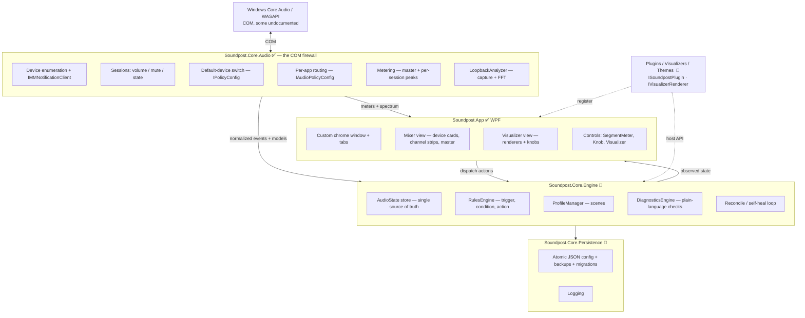

# Architecture

Soundpost is built as layers with a **single source of truth** and **one-way data flow**.
Design goals, in priority order: **reliability, observability, testability, and keeping the scary
Windows COM code sealed off from everything else.**

> Status markers below: ✅ built · 🚧 in progress · 🧭 planned. This document describes both the
> current code and the target it's growing into.

## Layer diagram

## Data flow (one direction)

1. Windows raises a COM event (device added, default changed, session created).
2. `Core.Audio` normalizes it into a plain model and raises a .NET event.
3. `Core.Engine` updates the **AudioState** store and runs the `RulesEngine` + `DiagnosticsEngine`.
4. The **UI observes** AudioState and re-renders. The UI never mutates audio directly.
5. A user action (or a rule firing) **dispatches an Action** (`SetDefaultDevice`, `RouteApp`, `ApplyScene`).
6. The Engine executes the Action **through `Core.Audio`**, which changes Windows state → raises an
   event → back to step 1. The loop closes; state stays true.

Two things bypass the Engine for latency reasons and read `Core.Audio` directly on the UI render
loop: **live meters** and the **visualizer spectrum**. They are read-only signals, never mutations.

## Key design decisions

### The COM firewall  ✅
Only `Soundpost.Core.Audio` references audio COM or NAudio. Undocumented interfaces (`IPolicyConfig`,
`IAudioPolicyConfig`) live behind small, documented service interfaces. Everything above is portable
and testable against fakes, and Windows 10 vs 11 interface differences are handled in exactly one place.

### AudioState as single source of truth  🧭
A snapshot of the world — devices, default endpoints per role, active sessions, their volumes/routes.
The UI is a pure function of this state; rules evaluate on its transitions. This is what makes
behavior predictable and debuggable.

### Actions are commands  🧭
Every mutation is an explicit, logged, **idempotent** Action — idempotent because the reconcile loop
may re-issue one to restore desired state. Actions report success/failure; failures surface in
Diagnostics rather than failing silently.

### Reconcile / self-heal  🧭
Your *desired* state (scenes/rules) is persisted. Windows' *actual* state drifts (updates reset
per-app routing; devices come and go). A periodic + event-driven reconcile compares desired vs. actual
and re-applies the difference. This is the mechanism behind "it remembers your intent."

### Persistence is defensive  🧭
Atomic writes (temp file → rename), timestamped backups, auto-restore on corruption, schema-versioned
config with forward migrations, and logs — all under `%AppData%\Soundpost`.

## The visualizer  ✅ / 🧭

`LoopbackAnalyzer` captures the default output (WASAPI loopback), keeps a rolling waveform, and
computes an FFT spectrum. The `Visualizer` control smooths that into bands each frame and hands it to
a **renderer**. Renderers are the extension point: each style (Ribbon, Spectrum, Radial, Oscilloscope,
Cymatics, Custom Image…) is a small, self-contained draw routine. Community renderers register into a
list and appear in the style picker — see [`visualizers/`](visualizers/) and [PLUGIN_SDK.md](PLUGIN_SDK.md).

## Extensibility  🧭

Three plug points, all designed so the community can extend Soundpost without touching core:

- **Plugins** — react to events and drive actions via a host API (`ISoundpostPlugin`).
- **Visualizers** — render styles (`IVisualizerRenderer`).
- **Themes** — resource dictionaries that reskin the console.

The full contract lives in [PLUGIN_SDK.md](PLUGIN_SDK.md); it's in design (RFC stage), so it's a great
place to shape the project early.

## Projects

| Project | Type | Responsibility | Status |
|---|---|---|---|
| `Soundpost.Core.Audio` | classlib (`net9.0-windows`) | All Windows audio interop; normalized models/services | ✅ |
| `Soundpost.App` | WPF app | Console UI, visualizer, custom controls, composition root | ✅ |
| `Soundpost.Probe` | console | Headless harness to exercise `Core.Audio` without a UI | ✅ |
| `Soundpost.Core.Engine` | classlib | AudioState, rules, scenes, diagnostics, reconcile | 🧭 |
| `Soundpost.Core.Persistence` | classlib | Config store, backups, migrations, logging | 🧭 |
| `tests/*` | xUnit | Unit tests against services/fakes | 🧭 |

## Testing strategy

`Core.Engine` / `Core.Persistence` / rules / diagnostics are (will be) tested against **fake**
`Core.Audio` services — no real hardware in CI. `Core.Audio` itself is validated interactively via
`Soundpost.Probe` on real machines, since it depends on live Windows audio state.

## Decisions & proposals

Significant choices are recorded as [Architecture Decision Records](docs/decisions/); larger changes
go through the [RFC process](docs/rfcs/).
