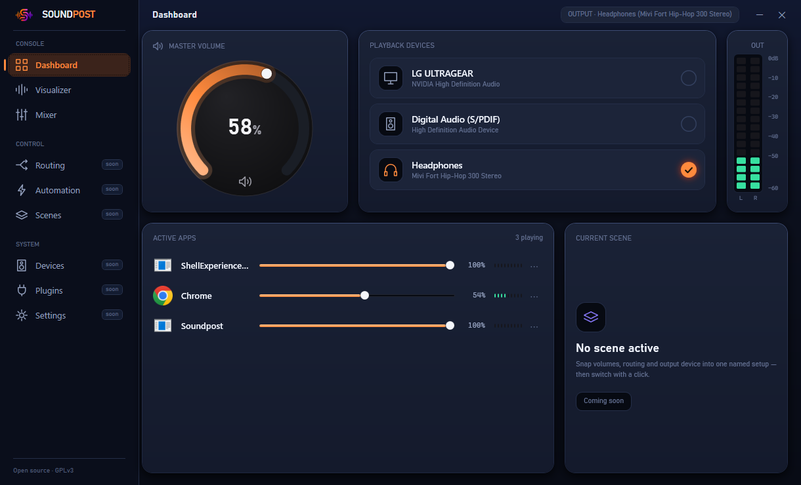
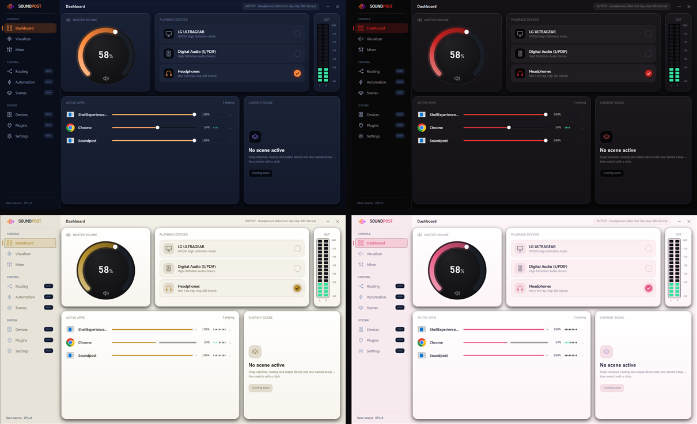
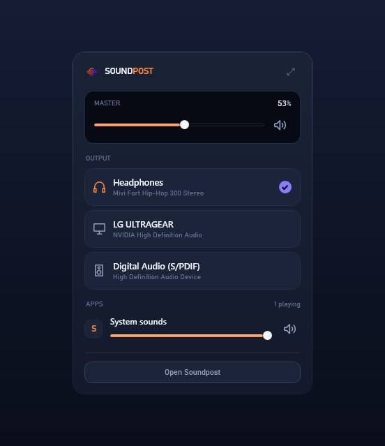

<div align="center">


# Soundpost

### 하나의 중심. 모든 소리.

**Windows 오디오를 위한 단일 콘솔: 출력 장치를 전환하고, 모든 앱을 믹싱하고, 소리를 *보세요* — 이 모든 것을 한곳에서. 로컬 우선, 계정 없음, 텔레메트리 없음.**

[](https://github.com/sathvik-zoldyck/Soundpost/actions/workflows/ci.yml)
[](LICENSE)
[](#받기)
[](#)
[](https://github.com/sathvik-zoldyck/Soundpost/stargazers)

**[로드맵](ROADMAP.md) · [아키텍처](ARCHITECTURE.md) · [플러그인 SDK](PLUGIN_SDK.md) · [기여하기](CONTRIBUTING.md) · [토론](../../discussions)**

[English](README.md) · [简体中文](README.zh.md) · [Español](README.es.md) · [हिन्दी](README.hi.md) · [العربية](README.ar.md) · [Português](README.pt.md) · [Français](README.fr.md) · [Deutsch](README.de.md) · [日本語](README.ja.md) · [Русский](README.ru.md) · **한국어**

<br/>



</div>

---

Windows는 오디오를 볼륨 플라이아웃, 장치 메뉴, 소리 제어판, 그리고 서로 대화하지 않는 여러 서드파티 도구에 흩어 놓습니다 — 게다가 어느 것도 당신의 의도를 기억하지 못합니다. **Soundpost는 그 빠져 있던 중심입니다.** 모든 장치와 모든 앱이 하나의 콘솔로 모입니다. 전환하고, 믹싱하고, 라우팅하면 소리는 올바른 출력으로 도착합니다. 그리고 그저 듣고 싶을 때, 비주얼라이저는 재생 중인 소리를 볼 만한 것으로 바꿔 줍니다.

## 기능

- **즉각적인 장치 전환.** 기본 출력 또는 입력을 한 번의 클릭으로 변경.
- **앱별 믹서.** 소리를 내는 모든 앱에 볼륨, 음소거, 실시간 미터.
- **실시간 출력 미터링.** 실제 탄도 특성을 갖춘 마스터 및 앱별 피크 미터.
- **비주얼라이저.** 일곱 가지 실시간 스타일 — Ribbon, Aurora, Spectrum, Radial, Oscilloscope, Cymatics, 사용자 지정 이미지 모드 — 가 60fps로 오디오에 반응하며, 감도·스무딩·글로우·팔레트를 조절할 수 있습니다.
- **전체 화면 오버레이.** 비주얼라이저를 음악 영상 위에 띄우고, 불투명·어둡게·완전 투명 배경 중에서 선택하세요.
- **퀵 패널.** 전체 콘솔을 열지 않고도 회의 중에 하는 동작을 위한 컴팩트한 트레이 플라이아웃.
- **네 가지 테마.** Indigo, Black & Red, Rich Gold, Cherry Blossom — 설정에서 실시간 전환 가능.
- **로컬이며 비공개.** 계정 없음, 클라우드 없음, 텔레메트리 없음. 모든 것이 당신의 기기에 남습니다.

## 살펴보기

<div align="center">



<sub><b>네 가지 테마, 실시간 전환.</b> Indigo, Black &amp; Red, Rich Gold, Cherry Blossom.</sub>

<br/><br/>



<sub><b>퀵 패널.</b> 마스터 볼륨, 출력 전환, 앱별 음소거 — 트레이에서 바로.</sub>

</div>

## 받기

Soundpost는 **Windows 10 및 11** 을 대상으로 합니다. 배포되면 [Releases](../../releases)에서 빌드를 받거나, 소스에서 빌드하세요:

```bash
git clone https://github.com/sathvik-zoldyck/Soundpost.git
cd Soundpost
dotnet run --project src/Soundpost.App
```

[.NET 9 SDK](https://dotnet.microsoft.com/download)가 필요합니다. 릴리스 워크플로는 단일 파일의 자체 포함형 `Soundpost.exe`(.NET 설치 불필요)를 생성합니다.

## 작동 방식

모든 앱과 장치가 하나의 중심으로 모입니다. 라우팅하고 믹싱하고 자동화하면 올바른 출력으로 도착합니다. 단일 Core Audio 계층이 Windows COM API를 감싸 앱의 나머지 부분이 그것들을 직접 건드리지 않게 하므로, 콘솔은 반응성이 유지되고 오디오 처리는 격리되어 테스트할 수 있습니다.

## 확장하기

Soundpost는 확장을 염두에 두고 만들어졌습니다.

- **비주얼라이저.** 스타일은 `IVisualizerRenderer`를 구현하는 하나의 클래스입니다 — [visualizers/](visualizers/) 참고. 작성하고 등록하면 스타일 바에 나타납니다.
- **테마.** 팔레트는 자체 포함형 딕셔너리입니다. 새 테마는 새 파일 하나와 스와치 하나면 됩니다.
- **플러그인.** 이벤트 기반 플러그인 표면이 로드맵에 있습니다 — [PLUGIN_SDK.md](PLUGIN_SDK.md) 참고.

## 로드맵

현재 제공: 장치 전환, 앱별 믹서와 미터, 비주얼라이저, 트레이와 퀵 패널, 상태 저장, 테마. 다음: 씬과 프로필, 자동화 계층, 앱별 라우팅, 쉬운 언어의 진단. 전체 계획은 [ROADMAP.md](ROADMAP.md)에 있습니다.

## 기여하기

새로운 비주얼라이저부터 버그 수정까지, 기여를 환영합니다. [CONTRIBUTING.md](CONTRIBUTING.md)에서 시작하고, [이슈](../../issues)를 열거나, [토론](../../discussions)에서 인사해 주세요. Soundpost가 유용하다면, 별 하나가 다른 사람들이 발견하는 데 도움이 됩니다.

## 라이선스

[GPLv3](LICENSE). 자유·오픈 소스 소프트웨어입니다.
