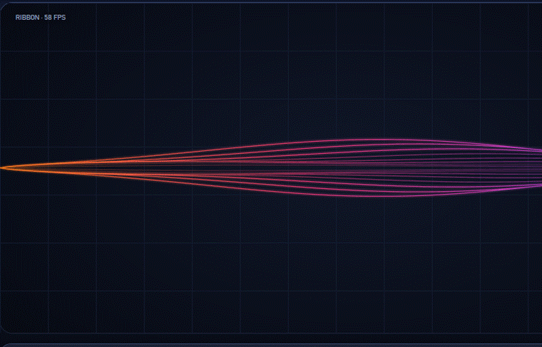

<div align="center">


# Soundpost

### One Center. Every Sound.

**The open audio hub for Windows — connect, control, and *see* every sound across your devices and apps.**
Local-first. No account. No telemetry.

[](https://github.com/sathvik-zoldyck/Soundpost/actions/workflows/ci.yml)
[](LICENSE)
[](#)
[](#)
[](CONTRIBUTING.md)
[](https://github.com/sathvik-zoldyck/Soundpost/stargazers)

**[Vision](VISION.md) · [Roadmap](ROADMAP.md) · [Architecture](ARCHITECTURE.md) · [Plugin SDK](PLUGIN_SDK.md) · [Contribute](CONTRIBUTING.md) · [Discussions](../../discussions)**

</div>

<div align="center">

<!-- ▶ HERO — add assets/media/hero.gif and uncomment this line:

-->
<br/>
<em>🎬 Demo GIF coming soon — screenshots & GIFs will live in <a href="assets/media/">assets/media/</a></em>

</div>

---

> **Soundpost is the intelligent center your audio never had.** Every app and device flows into one
> place; you route it, mix it, automate it, and it lands on the right output — every time. And when
> you just want to listen, the visualizer turns whatever's playing into something worth watching.

## Why Soundpost

Getting audio right on Windows means juggling **three or four tools that don't talk to each other** —
a volume mixer here, a device-switch hotkey there, a routing utility, and a lot of clicking in
Settings that **resets after every Windows update**. None of them remember your intent. You plug in
your headphones and nothing follows. Something breaks and Windows says nothing about why.

Soundpost is the missing brain — **one console for all of it**, plus an automation layer so you rarely
have to touch it.

## Features

- 🔀 **Instant device switching** — change your default output/input in one click (soon: a hotkey + tray).
- 🎚️ **Per-app mixer** — volume, mute, and **live meters** for every app making sound.
- 🎯 **Per-app routing** — send Spotify to your speakers and Discord to your headset, at the same time.
- 🎬 **Scenes** — save a whole setup (devices + routes + levels) as *Gaming*, *Movie Night*, *Meeting*
  and apply it in one click.
- 🤖 **Automation** — *"when my headphones connect, apply the Headphones scene."* Rules that fire on
  device connect/disconnect (app-launch, focus, and time triggers coming).
- 🩺 **Plain-language diagnostics** — *"this app is routed to a device that's unplugged"* — with a
  one-click fix, instead of silent failure.
- 🌈 **Visualizer** — a live *"Sound, seen"* view: glowing waves that react to your music, with
  switchable styles, palettes, and tactile knobs.
- 💾 **Reliable by design** — atomic saves, backups, and a self-heal loop that restores your setup
  after Windows shuffles things around.

**No account. No login. No telemetry. Fully local.**

## See it

<div align="center">

<!-- Add the files below to assets/media/ and uncomment. Keep them in this order.


-->
<em>Screenshots of the Mixer and Visualizer land here — see <a href="assets/media/">assets/media/</a>.</em>

</div>

## How it works

<div align="center">

**🎵 Apps &amp; devices** &nbsp;→&nbsp; **⭕ One center** &nbsp;→&nbsp; **🎚️ Route · mix · automate** &nbsp;→&nbsp; **🎧 Your outputs**

</div>

Every source flows into one intelligent center. Soundpost organizes, routes, and automates — then it
lands on the right device, every time. Only `Soundpost.Core.Audio` touches the raw Windows audio APIs
(the "COM firewall"); everything above works on clean, testable models. Full picture, with a diagram,
in **[ARCHITECTURE.md](ARCHITECTURE.md)**.

## Honesty first — what Soundpost is *not*

Windows has real limits, and we won't pretend otherwise:

- **Playing one sound on multiple outputs at once** isn't native to Windows — it needs software
  loopback (added latency) or a virtual driver. It's a clearly-labeled **experimental** module on the
  roadmap, not a first-release promise, because reliability is the whole point.
- **Equalizer / DSP** is fragile, driver-level territory (that's [Equalizer APO](https://sourceforge.net/projects/equalizerapo/)'s
  job). Soundpost won't reinvent it; we may *integrate* later.
- Some apps only read their audio device at startup, so a routing change may take effect after the app
  is nudged or restarted. Soundpost **tells you** when that's the case.

See [`docs/RESEARCH.md`](docs/RESEARCH.md) for the full competitive analysis and Windows-API study.

## Get started

> ⚠️ **Early development.** Soundpost is being built in the open. It's not packaged for install yet —
> ⭐ **star the repo** to follow along, and build from source below.

Requires the [.NET 9 SDK](https://dotnet.microsoft.com/download) on Windows 10/11.

```bash
git clone https://github.com/sathvik-zoldyck/soundpost.git
cd soundpost
dotnet build

# run the app
dotnet run --project src/Soundpost.App

# or exercise the audio layer headlessly (prints devices, reacts to plug/unplug)
dotnet run --project tools/Soundpost.Probe
```

## Extend Soundpost

The core stays small; the fun lives in an ecosystem anyone can build on — no forking required:

- 🌈 **[Visualizers](visualizers/)** — a render style for the "Sound, seen" view. The easiest, most fun way in.
- 🎭 **[Themes](themes/)** — reskin the console.
- 🔌 **[Plugins](plugins/)** — react to events (device connected, scene changed, audio peak) and
  automate anything. See the **[Plugin SDK](PLUGIN_SDK.md)**.
- 🖼️ **[Showcase](SHOWCASE.md)** — share your setup with the community.

## Roadmap

**Shipped:** the audio core (switching, per-app routing, live meters), the console UI, and the live
visualizer. **Next:** persistence + scenes, auto-switch rules, and plain-language diagnostics.

Full, living roadmap → **[ROADMAP.md](ROADMAP.md)**.

## Why we're building this

Windows treats your speakers, headphones, headset, and TV as an afterthought. The tools that fix it
are fragmented, closed, or fragile — and the good open ones don't cooperate. Soundpost is the attempt
to do it **once, properly, and in the open**: reliable enough to trust, honest about what Windows
allows, beautiful enough to enjoy, and extensible enough to outgrow us. Local-first, forever — your
audio setup is yours. Read the full thinking in **[VISION.md](VISION.md)**.

## The mark


- **The S** — Sound, System, Signal, Synchronization. The core of everything.
- **The center** — the hub where every audio stream is managed and routed.
- **The waves** — all your sources and destinations: apps, devices, mics, speakers.
- **The gradient** — from energy to intelligence; audio that flows and adapts with you.

*Balanced. Precise. Purposeful.* Name and logo usage: **[TRADEMARK.md](TRADEMARK.md)**.

## Documentation &amp; community

- 📖 [Vision](VISION.md) · [Roadmap](ROADMAP.md) · [Architecture](ARCHITECTURE.md) · [Plugin SDK](PLUGIN_SDK.md) · [Style Guide](STYLE_GUIDE.md)
- 💬 [Discussions](../../discussions) — questions, ideas, and **Show & tell**
- 🐛 [Issues](../../issues) — bugs and feature requests
- 🤝 [Contributing](CONTRIBUTING.md) · [Code of Conduct](CODE_OF_CONDUCT.md) · [Security](SECURITY.md)

## Contributing

Bug reports, design, themes, visualizers, plugins, docs, code — **you're welcome here.** Start with
[CONTRIBUTING.md](CONTRIBUTING.md) and look for [`good first issue`](../../labels/good%20first%20issue).

## License

[**GNU GPLv3**](LICENSE) — free to use, study, modify, and share; derivatives stay open. The
**Soundpost** name and logo are covered separately by [TRADEMARK.md](TRADEMARK.md). Built with respect
for the trails blazed by [EarTrumpet](https://github.com/File-New-Project/EarTrumpet) and
[SoundSwitch](https://github.com/Belphemur/SoundSwitch).

<div align="center">

---

**Control · Connect · Experience.**

⭐ **Star Soundpost** if you'd use this — it's how the project grows.

</div>
