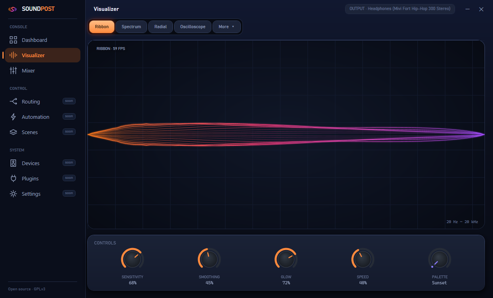

<div align="center">


# Soundpost

### One Center. Every Sound.

**The open audio hub for Windows — switch devices, mix every app, and *see* your sound. In one place.**
Local-first. No account. No telemetry.

[](https://github.com/sathvik-zoldyck/Soundpost/actions/workflows/ci.yml)
[](LICENSE)
[](#)
[](#)
[](https://github.com/sathvik-zoldyck/Soundpost/stargazers)

**[Roadmap](ROADMAP.md) · [Vision](VISION.md) · [Architecture](ARCHITECTURE.md) · [Plugin SDK](PLUGIN_SDK.md) · [Contribute](CONTRIBUTING.md) · [Discussions](../../discussions)**

<br/>


<sub>⭐ **Star it** to follow along — Soundpost is being built in the open, in public.</sub>

</div>

---

## What it is

Windows scatters your audio across four disconnected places — the volume mixer, the device flyout, a
routing utility, and Settings that resets after every update. **Soundpost is the one console that
brings them together:** switch your output in a click, set the level of every app, and watch it all
react — without hunting through menus. Local-first, and yours.

## See it

<div align="center">



<sub><strong>Visualizer</strong> — whatever's playing, drawn live at 60fps. Switchable styles, palettes, and real knobs.</sub>

<br/><br/>


<sub><strong>Quick Panel</strong> — the mid-meeting moves from the tray, without opening the full app: master volume, switch output, mute an app.</sub>

</div>

## What works today

| ✅ Shipped | 🔜 On the roadmap |
|---|---|
| One-click default-device switching | Scenes — save a whole setup, apply in a click |
| Per-app mixer: volume, mute, **live meters** | Auto-switch rules (*"headphones connect → this scene"*) |
| Live visualizer — 6 styles, 60fps, drop-in images | Per-app routing UI *(engine already works)* |
| Tray icon + **Quick Panel** flyout | Plain-language diagnostics + one-click fixes |
| Remembers your window, section, and setup | Global hotkeys + quick-switch overlay |

Full, living plan → **[ROADMAP.md](ROADMAP.md)**.

## Quick start

> ⚠️ **Early development** — not packaged for install yet. Build from source (needs the
> [.NET 9 SDK](https://dotnet.microsoft.com/download) on Windows 10/11):

```bash
git clone https://github.com/sathvik-zoldyck/soundpost.git
cd soundpost
dotnet run --project src/Soundpost.App
```

## Honest about Windows

Reliability is the whole point, so we won't oversell what the OS allows: playing one sound on
**multiple outputs** at once needs software loopback (added latency) — a clearly-labeled experimental
module, not a launch promise; system-wide **EQ/DSP** is fragile driver territory we may *integrate*
([Equalizer APO](https://sourceforge.net/projects/equalizerapo/)) rather than reinvent; and some apps
only read their device at startup, so Soundpost **tells you** when a change needs a restart. The full
study is in [`docs/RESEARCH.md`](docs/RESEARCH.md).

## Built to extend

The core stays small; the ecosystem is where the fun is — no forking required.

🌈 **[Visualizers](visualizers/)** · 🎭 **[Themes](themes/)** · 🔌 **[Plugins](PLUGIN_SDK.md)** — react to events and automate anything.

## Contributing

Bugs, design, themes, visualizers, plugins, docs, code — **you're welcome here.** A visualizer is the
easiest, most fun way in. Start with [CONTRIBUTING.md](CONTRIBUTING.md) and the
[`good first issue`](../../labels/good%20first%20issue) label.

Only `Soundpost.Core.Audio` touches the raw Windows APIs (the "COM firewall"); everything above is
clean, testable models — see [ARCHITECTURE.md](ARCHITECTURE.md).

## License

[**GNU GPLv3**](LICENSE) — free to use, study, modify, and share; derivatives stay open. The
**Soundpost** name and logo are covered by [TRADEMARK.md](TRADEMARK.md). Built with respect for
[EarTrumpet](https://github.com/File-New-Project/EarTrumpet) and
[SoundSwitch](https://github.com/Belphemur/SoundSwitch).

<div align="center">

---

**Control · Connect · Experience.**

⭐ **Star Soundpost** if you'd use this — it's how the project grows.

</div>
